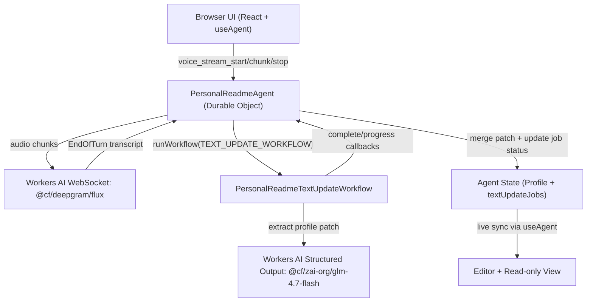

# Personal README agent

Personal README builder powered by Cloudflare Agents, Workers AI, and Deepgram Flux speech-to-text.

## Architecture



## Local Development

```bash
npm install
npm run dev
```

Build check:

```bash
npm run build
```

Preview in worker runtime:

```bash
npm run preview
```

## Deploy

```bash
npm run deploy
```
